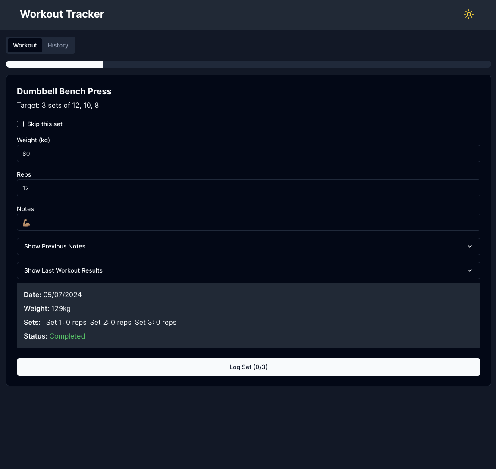
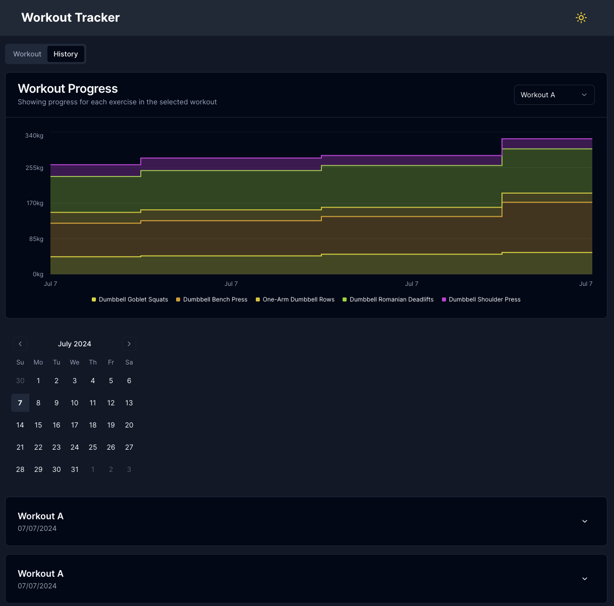

# EZ Workout Tracker

EZ Workout Tracker is a sleek, user-friendly (read: quick and dirty) application that I designed to help me track my workouts, visualize progress, and stay motivated on my fitness journey.

## Features

- **Workout Logging**: Easily log your workouts with customizable exercises, sets, reps, and weights.
- **Progress Tracking**: Visualize your progress with interactive charts showing total weight lifted, sets completed, and reps performed over time.
- **Workout History**: Review your past workouts with a detailed history view and an interactive calendar.
- **Dark Mode**: Toggle between light and dark modes for comfortable viewing in any environment.
- **Responsive Design**: Enjoy a seamless experience on both desktop and mobile devices.

## Screenshots

### Workout Logging



### Workout History



## Technologies Used

- Next.js 14 (App Router)
- TypeScript
- Tailwind CSS
- Shadcn UI
- Recharts
- Drizzle ORM
- Postgres

## Getting Started

### Prerequisites

- Node.js (v20 or later)
- bun
- PostgreSQL database

### Workout configuration

Change the seed data in `apps/web/src/db/seed.ts` to match your workouts.

### Installation

1. Clone the repository:

   ```
   git clone https://github.com/gmickel/ez-workout-tracker.git
   ```

2. Navigate to the project directory:

   ```
   cd ez-workout-tracker
   ```

3. Install dependencies:

   ```
   bun install
   ```

4. Set up your environment variables:
   Copy the `.env.template` file to `.env` and fill in the values.

5. Start the development server:

   ```
   bun run dev
   ```

6. Open [http://localhost:4000](http://localhost:4000) in your browser to see the application.

## Deployment

This project is set up for easy deployment on Vercel. Simply connect your GitHub repository to Vercel and deploy the web workspace (apps/web).

Make sure to add your `POSTRES_URL`, `INITIAL_USERNAME`, `INITIAL_PASSWORD`, and `JWT_SECRET` to your Vercel project's environment variables.

## Contributing

Contributions are welcome! Please feel free to submit a Pull Request.

## License

This project is licensed under the MIT License.

## Created from https://github.com/gmickel/turborepo-shadcn-nextjs
